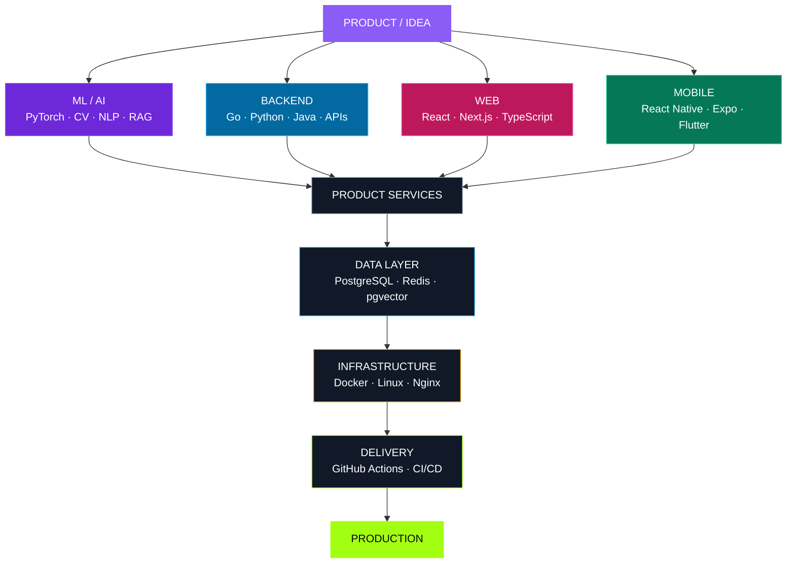

<!--
  BitsOfDanya / profile README
  Stable version: avoids fenced Markdown code blocks inside HTML tables,
  because that can make GitHub print closing HTML tags as plain text.
-->

 

  

  

Saint Petersburg · Building software, ML systems and digital products end-to-end

---

## `01 / PROFILE`

<table>
<tr>
<td width="64%" valign="top">

### Hi, I'm Daniil.

I'm a **Machine Learning Engineer, Software Engineer and Tech Lead** working across applied AI and modern product engineering.

My strongest specialization is **production Machine Learning**: Computer Vision, video understanding, NLP, embeddings, retrieval and multimodal systems.

I also design and build the software around models — **backend services, APIs, databases, web interfaces, mobile applications, infrastructure and delivery pipelines**.

I am most useful where a product needs one coherent technical picture instead of disconnected technologies.

**ML × Backend × Frontend × Mobile × Infrastructure × Product Architecture**

I care about measurable product value, maintainable architecture and actually shipping the result.

</td>
<td width="36%" valign="top">

### `SYSTEM.IDENTITY`

<pre><code>name: Daniil Chepko
username: BitsOfDanya

roles:
  - ML Engineer
  - Software Engineer
  - Tech Lead

location:
  Saint Petersburg

working_mode:
  - research
  - architecture
  - engineering
  - delivery

telegram:
  @bits_of_danya</code></pre>

</td>
</tr>
</table>

<table>
<tr>
<td align="center" width="25%">

### `3+`

Years in production ML

</td>
<td align="center" width="25%">

### `50+`

Hackathon wins & prizes

</td>
<td align="center" width="25%">

### `6`

Engineering directions

</td>
<td align="center" width="25%">

### `0 → 1`

Idea to production

</td>
</tr>
</table>

 

**`IDEA → ARCHITECTURE → ENGINEERING → PRODUCTION`**

---

## `02 / ENGINEERING STACK`

### Languages

  

### Frameworks & Platforms

  

### Data · Infrastructure · Delivery

 

<table>
<tr>
<td width="25%" valign="top">

### 🟣 `ML / AI`

**Core**

`Python` · `PyTorch` · `OpenCV`

**Applied**

`Computer Vision`  
`Video Understanding`  
`Classification`  
`NLP`  
`Transformers`  
`Embeddings`  
`Multimodal ML`

**AI Systems**

`RAG`  
`LLM APIs`  
`LangChain`  
`LangGraph`  
`Semantic Retrieval`  
`Vector Search`

**Engineering**

`Training`  
`Evaluation`  
`Inference`  
`ML Pipelines`

</td>
<td width="25%" valign="top">

### 🔵 `BACKEND`

**Languages**

`Go` · `Python` · `Java` · `C++`

**Frameworks**

`Gin`  
`chi`  
`FastAPI`  
`Node.js`

**APIs & Services**

`REST`  
`WebSocket`  
`OpenAPI / Swagger`  
`Authentication`  
`Background Workers`  
`Integrations`

**Architecture**

`Service Design`  
`Repository Pattern`  
`Object Storage`

</td>
<td width="25%" valign="top">

### 🩷 `FRONTEND`

**Core**

`TypeScript` · `JavaScript`

**Frameworks**

`React`  
`Next.js`  
`Vite`

**UI**

`Tailwind CSS`  
`shadcn/ui`  
`HTML / CSS`

**Products**

`SaaS Interfaces`  
`Dashboards`  
`Admin Panels`  
`Landing Pages`  
`Responsive UI`  
`Design Systems`

</td>
<td width="25%" valign="top">

### 🟢 `MOBILE`

**React ecosystem**

`React Native`  
`Expo`

**Flutter ecosystem**

`Flutter`  
`Dart`

**Platforms**

`iOS` · `Android`

**Engineering**

`App Architecture`  
`Navigation`  
`API Integration`  
`Authentication`  
`State Management`  
`Cross-platform UI`

</td>
</tr>
</table>

<table>
<tr>
<td width="33%" valign="top">

### 🟡 `DATA`

`PostgreSQL`  
`Redis`  
`SQL`  
`pgvector`  
`Vector Search`  
`S3-compatible Storage`  
`MinIO`  
`Firebase`

</td>
<td width="33%" valign="top">

### 🟠 `DEVOPS / INFRA`

`Docker`  
`Docker Compose`  
`Linux`  
`Nginx`  
`GitHub Actions`  
`CI/CD`  
`Networking`  
`Environment Configuration`  
`Deployment`

</td>
<td width="33%" valign="top">

### ⚪ `ARCHITECTURE`

`System Design`  
`API Design`  
`Data Modeling`  
`Service Decomposition`  
`Integration Design`  
`Technical Strategy`  
`MVP → Production`  
`Engineering Leadership`

</td>
</tr>
</table>

<b>🧩 Extended engineering map</b>

 

<table>
<tr>
<td width="33%" valign="top">

### `SYSTEMS`

- Java
- C++
- C
- Algorithms
- Data structures
- Computer networks
- System administration
- Performance thinking

</td>
<td width="33%" valign="top">

### `PRODUCT`

- Technical discovery
- Scope definition
- Rapid prototyping
- Product analytics
- Cross-functional work
- Feature decomposition
- Delivery ownership

</td>
<td width="33%" valign="top">

### `QUALITY`

- API documentation
- Testing strategy
- Code review
- Monitoring basics
- Release preparation
- Performance iteration
- Production handoff

</td>
</tr>
</table>

---

## `03 / SYSTEM MAP`

**Different stacks. One technical system. One product outcome.**

---

## `04 / SELECTED PRODUCTS`

<table>
<tr>
<td width="50%" valign="top">

### `01 / CADIO.`

#### SportsTech · Web · Mobile

Digital ecosystem for **athletes, sports communities, clubs and event organizers**.

The product connects community discovery, events, participant experiences and organizer tools across web and mobile.

`SportsTech` · `Web` · `Mobile` · `Platform`

</td>
<td width="50%" valign="top">

### `02 / TRUSTDESK`

#### AI · B2B SaaS · Knowledge Work

AI-powered workspace for **document intelligence, business knowledge and decision-making**.

The product combines document analysis, risk-oriented workflows, knowledge retrieval and collaboration.

`AI` · `B2B SaaS` · `Documents` · `RAG`

</td>
</tr>
<tr>
<td width="50%" valign="top">

### `03 / POLYK`

#### EdTech · Community · Marketplace

University-focused ecosystem built around **teachers, reviews, educational materials, mentoring and student services**.

The goal is to turn fragmented university knowledge into a practical student platform.

`EdTech` · `Community` · `Marketplace` · `Platform`

</td>
<td width="50%" valign="top">

### `04 / KARETA`

#### Gaming · Social Platform

Gaming community product combining **social content, user profiles, chats, tournaments, marketplace mechanics and user-created experiences**.

`Gaming` · `Mobile` · `Community` · `Marketplace`

</td>
</tr>
<tr>
<td width="50%" valign="top">

### `05 / SMARTBLOODTEST`

#### MedTech · Image Analysis

Software workflow for **laboratory image analysis and blood-group phenotyping** with preliminary automated analysis and remote specialist validation.

`MedTech` · `Computer Vision` · `Automation` · `Web / Mobile`

</td>
<td width="50%" valign="top">

### `06 / ML & HACKATHON R&D`

#### AI · Engineering · Rapid Prototyping

Applied projects across **Computer Vision, NLP, multimodal ML, retrieval, LLM agents, backend systems and end-to-end product prototypes**.

`ML` · `AI Systems` · `Backend` · `R&D` · `Product`

</td>
</tr>
</table>

<b>⚡ What I can own inside a product</b>

 

| Stage | Focus | Typical output |
|---|---|---|
| `01 · DISCOVER` | Turn an idea into a technical problem | Requirements, risks, scope, success metrics |
| `02 · DESIGN` | Define architecture and boundaries | System design, API contracts, data model |
| `03 · BUILD` | Implement critical product layers | ML pipeline, backend, web or mobile client |
| `04 · INTEGRATE` | Connect services, data and flows | End-to-end product scenario |
| `05 · SHIP` | Prepare the system for real usage | Docker, CI/CD, documentation, deployment |
| `06 · IMPROVE` | Remove technical bottlenecks | Evaluation, analytics, performance iteration |

---

## `05 / ENGINEERING MODES`

<table>
<tr>
<td align="center" width="16.6%">

### 🧠 ML

Models  
Evaluation  
Pipelines  
Retrieval

</td>
<td align="center" width="16.6%">

### ⚙️ Backend

APIs  
Services  
Databases  
Workers

</td>
<td align="center" width="16.6%">

### 🖥️ Web

SaaS  
Dashboards  
Admin tools  
Interfaces

</td>
<td align="center" width="16.6%">

### 📱 Mobile

iOS / Android  
Cross-platform  
Integration  
UX flows

</td>
<td align="center" width="16.6%">

### 🚀 DevOps

Containers  
CI/CD  
Deployment  
Infrastructure

</td>
<td align="center" width="16.6%">

### 🧭 Lead

Architecture  
Strategy  
Delivery  
Ownership

</td>
</tr>
</table>

---

## `06 / CURRENT FOCUS`

<table>
<tr>
<td width="50%" valign="top">

### `ENGINEERING`

<pre><code>web:
  - TypeScript
  - React
  - Next.js

mobile:
  - React Native
  - Expo
  - Flutter

backend:
  - Go
  - Python
  - Java
  - PostgreSQL
  - Redis</code></pre>

</td>
<td width="50%" valign="top">

### `INTELLIGENCE`

<pre><code>machine_learning:
  - Computer Vision
  - Video Understanding
  - NLP
  - Multimodal ML

ai_systems:
  - Embeddings
  - Retrieval
  - RAG
  - LLM Applications</code></pre>

</td>
</tr>
</table>

---

## `07 / GITHUB SIGNAL`

 

GitHub language cards reflect public repository bytes, not professional proficiency.

---

## `LET'S BUILD SOMETHING USEFUL`

### ML · Backend · Frontend · Mobile · DevOps · Architecture

  

**`BUILD → SHIP → IMPROVE`**

 

Daniil Chepko · BitsOfDanya

