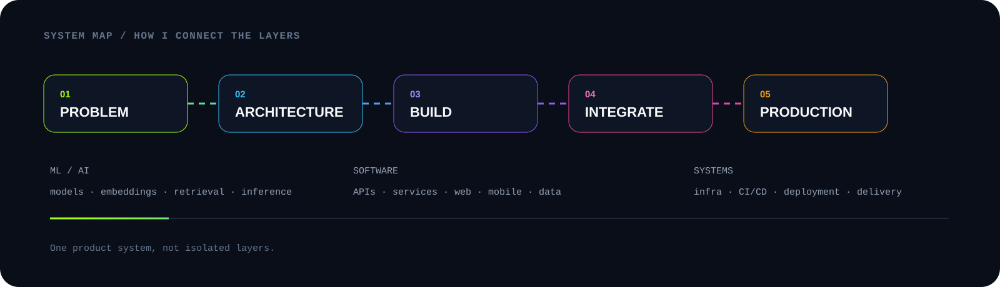
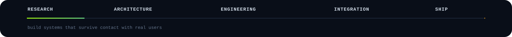

<!--
BITS OF DANYA — PROFILE README
Goal: technical portfolio, not a widget wall.
Local SVGs are self-hosted in this repository.
-->

 

 

<table width="100%" align="center">
<tr>
<td width="63%" valign="top">

### 30-second profile

I'm **Daniil Chepko** — an **ML Engineer, Software Engineer and Tech Lead**.

My strongest specialization is production-oriented **Machine Learning**: Computer Vision, video understanding, NLP, embeddings, retrieval and multimodal systems. I care about the part after the experiment too — inference, integration, data flow, latency and how the model behaves inside a real product.

I also work across **backend, frontend, mobile and infrastructure**. I design APIs and data models, build product interfaces, connect clients, containerize services and make technical decisions across the system.

The common thread is simple: I like taking a difficult product or engineering problem and turning it into a working system.

</td>
<td width="37%" valign="top">

### Engineering scope

**Primary**  
Production ML · AI systems

**Strong**  
Backend · Architecture · Data

**Product layers**  
Web · Mobile · APIs · Infrastructure

**Working mode**  
R&D · 0 → 1 · Production delivery

**Contact**  
[@bits_of_danya](https://t.me/bits_of_danya)

</td>
</tr>
</table>

<table width="100%" align="center">
<tr>
<td width="25%" align="center"><b>3+</b> years in production ML</td>
<td width="25%" align="center"><b>50+</b> hackathon wins & prizes</td>
<td width="25%" align="center"><b>6</b> engineering directions</td>
<td width="25%" align="center"><b>0 → 1</b> idea to working product</td>
</tr>
</table>

 

---

<h2 align="center">SELECTED WORK</h2>

Products and systems that represent the kind of engineering I do.

<table width="100%" align="center">
<tr>
<td width="50%" valign="top">

### 01 — Cadio
**SportsTech platform**

Digital ecosystem for athletes, sports communities, clubs and event organizers. It connects community discovery, events, participant experiences and organizer workflows across web and mobile.

**Engineering surface**  
Product architecture · web/mobile · backend integration · platform thinking

`SportsTech` `Web` `Mobile` `Community`

</td>
<td width="50%" valign="top">

### 02 — TrustDesk
**AI workspace for business**

B2B workspace for document intelligence, organizational knowledge and decision-making. It combines document analysis, retrieval, AI-assisted workflows, risk-oriented flows and collaboration.

**Engineering surface**  
AI product design · RAG · backend/data · complex business workflows

`AI` `B2B SaaS` `RAG` `Knowledge Work`

</td>
</tr>
<tr>
<td width="50%" valign="top">

### 03 — PolyK
**University / student ecosystem**

Platform around teachers, reviews, educational materials, mentoring, student requests and community-driven services — turning fragmented university knowledge into a practical digital product.

**Engineering surface**  
Community product · marketplace mechanics · APIs · platform architecture

`EdTech` `Community` `Marketplace` `Platform`

</td>
<td width="50%" valign="top">

### 04 — KARETA
**Gaming community platform**

Mobile-first gaming ecosystem combining profiles, social content, communication, tournaments, marketplace mechanics and user-created experiences.

**Engineering surface**  
Mobile platform · realtime product flows · social + transactional mechanics

`Gaming` `Mobile` `Social` `Marketplace`

</td>
</tr>
<tr>
<td width="50%" valign="top">

### 05 — SmartBloodTest
**MedTech / image analysis**

Software workflow for laboratory image processing and blood-group phenotyping: image submission, preliminary automated analysis, result presentation and remote validation by a laboratory specialist.

**Engineering surface**  
Computer Vision · medical workflow · backend · web/mobile integration

`MedTech` `Computer Vision` `Automation` `Workflow`

</td>
<td width="50%" valign="top">

### 06 — ML / Hackathon R&D
**Applied engineering under constraints**

Research and product prototypes across Computer Vision, NLP, multimodal ML, retrieval, LLM agents and backend systems — often built under strict time, data or compute constraints.

**Engineering surface**  
Fast research · architecture · prototype → working demo

`ML` `R&D` `Backend` `Architecture`

</td>
</tr>
</table>

---

<h2 align="center">TECHNICAL SURFACE</h2>

<table width="100%" align="center">
<tr>
<td width="33%" valign="top">

### Intelligence

Computer Vision  
Video Understanding  
NLP  
Embeddings  
Multimodal ML  
Retrieval / RAG  
Vector Search  
Inference

</td>
<td width="33%" valign="top">

### Software

Backend Services  
REST / WebSocket APIs  
Web Products  
Mobile Apps  
Databases  
Workers / Jobs  
Integrations  
Product Interfaces

</td>
<td width="33%" valign="top">

### Systems

System Design  
Data Modeling  
Infrastructure  
CI/CD  
Deployment  
Technical Strategy  
Delivery  
Tech Leadership

</td>
</tr>
</table>

---

<h2 align="center">STACK</h2>

Languages

  

  

Frameworks · data · infrastructure

  

 

<table width="100%" align="center">
<tr>
<td width="50%" valign="top">

### ML / AI

**Core**  
`Python` · `C++` · `PyTorch` · `OpenCV`

**Data / classical ML**  
`NumPy` · `Pandas` · `scikit-learn` · `Feature Engineering`

**Computer Vision**  
`Image Classification` · `Video Classification` · `Feature Extraction` · `Visual Embeddings`

**NLP / representation learning**  
`Transformers` · `Text Classification` · `Embeddings` · `Semantic Similarity`

**AI systems**  
`Multimodal ML` · `RAG` · `LLM APIs` · `LangChain` · `LangGraph` · `Vector Retrieval`

**Production ML**  
`Training Pipelines` · `Evaluation` · `Inference` · `Model Integration` · `Latency-aware ML`

</td>
<td width="50%" valign="top">

### Backend / Data

**Languages**  
`Go` · `Python` · `Java` · `C++`

**Frameworks**  
`Gin` · `chi` · `FastAPI` · `Node.js`

**Communication**  
`REST` · `WebSocket` · `OpenAPI / Swagger`

**Data**  
`PostgreSQL` · `Redis` · `SQL` · `pgvector` · `Vector Search`

**Services**  
`Authentication` · `Workers` · `Jobs` · `Object Storage` · `Integrations`

**Engineering**  
`Data Modeling` · `API Contracts` · `Service Design` · `Business Logic`

</td>
</tr>
<tr>
<td width="50%" valign="top">

### Frontend

**Languages**  
`TypeScript` · `JavaScript` · `HTML` · `CSS`

**Core**  
`React` · `Next.js` · `Vite`

**UI / styling**  
`Tailwind CSS` · `shadcn/ui` · `Responsive UI` · `Design Systems`

**Product interfaces**  
`SaaS` · `Dashboards` · `Admin Panels` · `Landing Pages`

**Frontend engineering**  
`Authentication Flows` · `API Integration` · `Client State` · `Reusable Components`

</td>
<td width="50%" valign="top">

### Mobile / Infrastructure

**Mobile**  
`React Native` · `Expo` · `Flutter` · `Dart`

**Platforms**  
`iOS` · `Android`

**App engineering**  
`Navigation` · `State Management` · `Authentication` · `API Integration`

**Infrastructure**  
`Docker` · `Docker Compose` · `Linux` · `Nginx`

**Delivery**  
`GitHub Actions` · `CI/CD` · `Environment Configuration` · `Deployment`

</td>
</tr>
</table>

<b>Extended engineering toolbox</b>

 

<table width="100%" align="center">
<tr>
<td width="33%" valign="top">

### Systems
`C` · `C++` · `Java`

Algorithms  
Data Structures  
Computer Networks  
System Administration  
Performance Thinking

</td>
<td width="33%" valign="top">

### Architecture
System Design  
API Design  
Database Design  
Service Decomposition  
Integration Design  
Technical Strategy

</td>
<td width="33%" valign="top">

### Delivery
Git / GitHub  
CI/CD  
API Documentation  
Testing Strategy  
Code Review  
Release Preparation

</td>
</tr>
</table>

---

<h2 align="center">ENGINEERING PRACTICE</h2>

<table width="100%" align="center">
<tr>
<td width="25%" valign="top">

### 01 / Frame
Understand the actual problem, constraints, data and target outcome.

</td>
<td width="25%" valign="top">

### 02 / Design
Choose architecture, interfaces and boundaries before adding complexity.

</td>
<td width="25%" valign="top">

### 03 / Build
Implement the smallest coherent system that proves the product scenario.

</td>
<td width="25%" valign="top">

### 04 / Ship
Integrate the layers, deploy, validate and iterate against reality.

</td>
</tr>
</table>

 

> **The goal is not to use the maximum number of technologies. The goal is to make the whole system work — clearly, reliably and with a reason for every major technical decision.**

---

<h2 align="center">WHAT I BRING</h2>

<table width="100%" align="center">
<tr>
<td width="50%" valign="top">

### Cross-layer ownership

I can move between model logic, backend services, data, product UI, mobile clients and deployment without treating them as unrelated worlds.

That is especially useful in **AI products**, where the quality of the final system depends on much more than the model itself.

</td>
<td width="50%" valign="top">

### Fast technical execution

Hackathons and R&D work trained me to understand unfamiliar domains quickly, cut through unnecessary complexity and get a technically credible scenario working under hard constraints.

The same mindset is useful for **MVPs, prototypes and 0 → 1 product work**.

</td>
</tr>
</table>

---

 

### Have a hard technical problem worth building?

  

Daniil Chepko · BitsOfDanya

