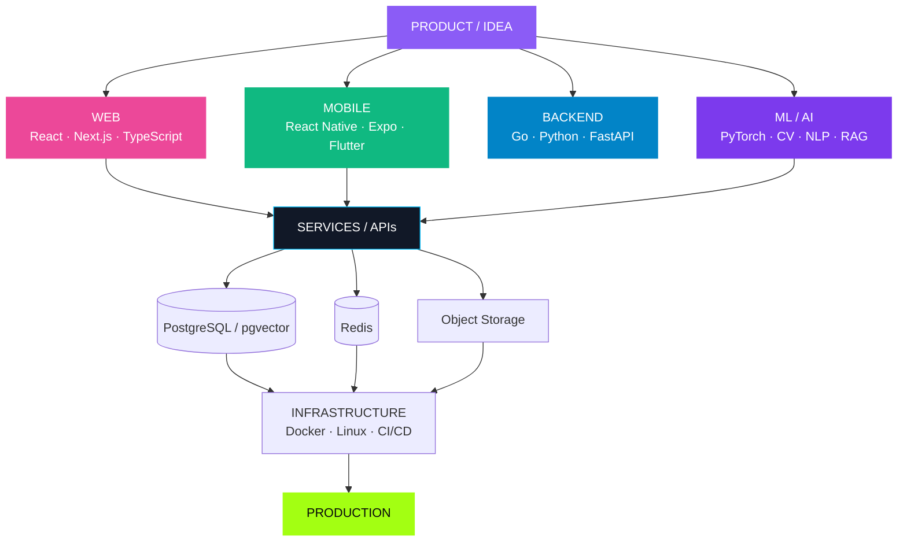

<!-- ========================================================= -->

<!--                    BITS OF DANYA                          -->

<!-- ========================================================= -->

<div align="center">


<br/>

<a href="https://t.me/bits_of_danya">
  
</a>

<a href="https://github.com/BitsOfDanya">
  
</a>

<br/><br/>

<b>ML / AI</b>
 ·  <b>Backend</b>
 ·  <b>Frontend</b>
 ·  <b>Mobile</b>
 ·  <b>Architecture</b>

<br/><br/>

<sub>Saint Petersburg · Building real software and ML systems</sub>

</div>

---

# `01 / ABOUT`

<table>
<tr>
<td width="66%" valign="top">

## Hi, I'm Daniil.

I'm an **ML & Software Engineer / Tech Lead** working across machine learning and modern product development.

My strongest engineering direction is **Machine Learning**, especially Computer Vision, video understanding, NLP, embeddings and multimodal systems.

But my work is not limited to ML.

I build **backend services, web applications and mobile products**, design databases and APIs, work with infrastructure and make technical decisions across the complete product lifecycle.

My preferred type of work is where several areas meet:

**ML + Backend + Frontend + Mobile + Product Architecture**

I care less about adding another technology to a stack and more about making all parts of a system work correctly together.

</td>

<td width="34%" valign="top">

### `PROFILE`

```yaml
name: Daniil Chepko

roles:
  - ML Engineer
  - Software Engineer
  - Tech Lead

areas:
  - ML / AI
  - Backend
  - Web
  - Mobile
  - Architecture

location:
  Saint Petersburg

username:
  BitsOfDanya
```

</td>
</tr>
</table>

<br/>

<div align="center">

### `IDEA  →  ARCHITECTURE  →  ENGINEERING  →  PRODUCTION`

</div>

---

# `02 / ENGINEERING STACK`

<div align="center">

### Languages & Core

<br/>


<br/><br/>

### Platforms & Frameworks

<br/>


<br/><br/>

### Data & Infrastructure

<br/>


</div>

<br/>

<table>
<tr>

<td width="25%" valign="top">

## `ML / AI`


<br/><br/>

**Core**

`Python`
`PyTorch`
`OpenCV`

**Applied ML**

`Computer Vision`
`Video Understanding`
`Classification`
`NLP`
`Transformers`
`Embeddings`
`Multimodal ML`

**AI Systems**

`RAG`
`LLM APIs`
`LangChain`
`LangGraph`
`Semantic Retrieval`
`Vector Search`

**Engineering**

`Training`
`Evaluation`
`Inference`
`ML Pipelines`

</td>

<td width="25%" valign="top">

## `BACKEND`


<br/><br/>

**Languages**

`Go`
`Python`

**Frameworks**

`Gin`
`chi`
`FastAPI`

**API**

`REST`
`OpenAPI`
`Swagger`
`WebSocket`

**Data**

`PostgreSQL`
`pgx`
`Redis`
`pgvector`

**Systems**

`Auth`
`Workers`
`Object Storage`
`Service Architecture`

</td>

<td width="25%" valign="top">

## `WEB`


<br/><br/>

**Core**

`TypeScript`
`JavaScript`
`React`

**Frameworks**

`Next.js`
`Vite`

**UI**

`Tailwind CSS`
`shadcn/ui`
`HTML / CSS`

**Products**

`SaaS`
`Dashboards`
`Admin Panels`
`Landing Pages`
`Responsive UI`

**Integration**

`REST APIs`
`Authentication`
`Client State`

</td>

<td width="25%" valign="top">

## `MOBILE`


<br/><br/>

**React ecosystem**

`React Native`
`Expo`

**Flutter ecosystem**

`Flutter`
`Dart`

**Platforms**

`iOS`
`Android`

**Engineering**

`API Integration`
`Authentication`
`Navigation`
`State`
`Responsive UI`

**Architecture**

`Shared Backend`
`Web + Mobile`

</td>

</tr>
</table>

---

## `INFRA / DATA / DELIVERY`

<table>
<tr>

<td width="33%" valign="top">

### Infrastructure

`Docker`

`Docker Compose`

`Linux`

`Nginx`

`Networking`

`Environment Configuration`

</td>

<td width="33%" valign="top">

### Data

`PostgreSQL`

`Redis`

`pgvector`

`SQL`

`Vector Search`

`S3-compatible Storage`

`MinIO`

</td>

<td width="33%" valign="top">

### Delivery

`Git`

`GitHub`

`GitHub Actions`

`CI/CD`

`Netlify`

`API Documentation`

`Deployment`

</td>

</tr>
</table>

---

# `03 / HOW THE STACK CONNECTS`



<div align="center">

<sub>
Different stacks. One product.
</sub>

</div>

---

# `04 / SELECTED PROJECTS`

<table>

<tr>

<td width="50%" valign="top">

### `01`

# Cadio.

**SportsTech · Platform**

Digital ecosystem for athletes, sports communities, clubs and event organizers.

The product brings together community discovery, events, participant experiences and organizer tools across web and mobile.

`Web` · `Mobile` · `Platform` · `SportsTech`

</td>

<td width="50%" valign="top">

### `02`

# TrustDesk

**AI · B2B SaaS**

AI-powered workspace focused on business documents, knowledge and decision-making.

The product combines document intelligence, risks, AI-assisted workflows and collaboration tools.

`AI` · `SaaS` · `RAG` · `Documents`

</td>

</tr>

<tr>

<td width="50%" valign="top">

### `03`

# PolyK

**EdTech · Community**

University-focused ecosystem combining teachers, reviews, educational materials, mentoring and student services.

`EdTech` · `Community` · `Marketplace` · `Platform`

</td>

<td width="50%" valign="top">

### `04`

# KARETA

**Gaming · Social Platform**

Gaming-oriented community platform combining social content, profiles, communication, tournaments, marketplace mechanics and user-created experiences.

`Gaming` · `Mobile` · `Community` · `Marketplace`

</td>

</tr>

<tr>

<td width="50%" valign="top">

### `05`

# SmartBloodTest

**MedTech · Computer Vision**

Software workflow for laboratory image analysis and blood-group phenotyping with preliminary automated analysis and remote validation by a laboratory specialist.

`MedTech` · `Image Analysis` · `Web` · `Mobile`

</td>

<td width="50%" valign="top">

### `06`

# ML / Hackathon R&D

**AI · Engineering · Rapid Prototyping**

Applied technical projects across Computer Vision, NLP, multimodal ML, retrieval, LLM agents and complete product prototypes.

`ML` · `AI` · `Backend` · `R&D`

</td>

</tr>

</table>

---

# `05 / WHAT I BUILD`

<table>
<tr>

<td width="25%" align="center">

## ML

Models
Pipelines
Retrieval
Multimodal
AI integrations

</td>

<td width="25%" align="center">

## Backend

APIs
Services
Databases
Workers
Integrations

</td>

<td width="25%" align="center">

## Web / Mobile

Web Apps
SaaS
Dashboards
Native Apps
Interfaces

</td>

<td width="25%" align="center">

## Architecture

System Design
Technical Strategy
Infrastructure
Product Engineering
Tech Leadership

</td>

</tr>
</table>

<br/>

```text
                     ┌──────────────────────┐
                     │      PRODUCT         │
                     └──────────┬───────────┘
                                │
        ┌───────────────────────┼───────────────────────┐
        │                       │                       │
        ▼                       ▼                       ▼
      ML / AI                BACKEND              WEB / MOBILE
        │                       │                       │
        └───────────────────────┼───────────────────────┘
                                │
                                ▼
                         INFRASTRUCTURE
                                │
                                ▼
                           PRODUCTION
```

---

# `06 / CURRENT FOCUS`

<div align="center">


</div>

<br/>

<table>
<tr>
<td width="50%" valign="top">

### Engineering

```yaml
web:
  - TypeScript
  - React
  - Next.js

mobile:
  - React Native
  - Expo
  - Flutter

backend:
  - Go
  - Python
  - PostgreSQL
  - Redis
```

</td>

<td width="50%" valign="top">

### ML / AI

```yaml
ml:
  - Computer Vision
  - Video Understanding
  - NLP
  - Multimodal ML

ai:
  - Embeddings
  - Retrieval
  - RAG
  - LLM Systems
```

</td>
</tr>
</table>

---

# `07 / GITHUB ACTIVITY`

<div align="center">


<br/>


</div>

---

<div align="center">

# `LET'S CONNECT`

### ML · Backend · Web · Mobile · Product

<br/>

<a href="https://t.me/bits_of_danya">
  
</a>

<a href="https://github.com/BitsOfDanya">
  
</a>

<br/><br/>

### `BUILD → SHIP → IMPROVE`

<br/>

<sub>Daniil Chepko · BitsOfDanya</sub>

</div>


