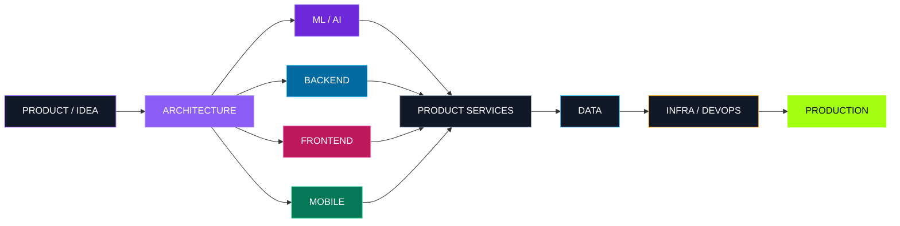

<!--
BitsOfDanya — GitHub Profile README
No GitHub Actions required.
External visual services:
- readme-typing-svg
- skillicons.dev
- shields.io
- github-readme-activity-graph
- komarev profile views
-->

# DANIIL CHEPKO

### ML Engineer · Software Engineer · Tech Lead

 

  

  

  

Saint Petersburg · Building ML systems, software products and platforms end-to-end

---

<h2 align="center">01 / ABOUT</h2>

<table width="100%" align="center">
<tr>
<td width="60%" valign="top">

### Who I am

I'm **Daniil Chepko** — an **ML Engineer, Software Engineer and Tech Lead**.

My strongest technical specialization is **Machine Learning**: Computer Vision, video understanding, NLP, embeddings, retrieval and multimodal systems. I work with ML not as an isolated research layer, but as part of real software products.

Beyond ML, I build **backend services and APIs, data layers, web applications, mobile clients and infrastructure**, and I work with product and system architecture from early technical decisions to delivery.

My background combines production ML, full-cycle product engineering, infrastructure and rapid R&D. I especially enjoy projects where different technical disciplines have to become **one coherent system**.

**Main engineering space:**  
`ML / AI` · `Backend` · `Frontend` · `Mobile` · `DevOps` · `Architecture`

</td>
<td width="40%" valign="top">

### Engineering profile

**ML / AI**  
Production ML · CV · NLP · Multimodal · Retrieval

**Backend**  
Go · Python · APIs · Services · Data

**Frontend**  
TypeScript · React · Next.js · Product UI

**Mobile**  
React Native · Expo · Flutter

**Infrastructure**  
Docker · Linux · Nginx · CI/CD

**Architecture**  
System Design · Technical Strategy · Delivery

**Contact**  
[@bits_of_danya](https://t.me/bits_of_danya)

</td>
</tr>
</table>

<table width="100%" align="center">
<tr>
<td width="25%" align="center">

### `3+`
Years in production ML

</td>
<td width="25%" align="center">

### `50+`
Hackathon wins & prizes

</td>
<td width="25%" align="center">

### `6`
Engineering directions

</td>
<td width="25%" align="center">

### `0 → 1`
Idea to production

</td>
</tr>
</table>

 

`RESEARCH` → `ARCHITECTURE` → `ENGINEERING` → `PRODUCTION`

---

<h2 align="center">02 / TECHNOLOGY STACK</h2>

### Languages

  

### Web · Mobile · Backend

  

### Data · Infrastructure · Delivery

 

<table width="100%" align="center">
<tr>
<td width="50%" valign="top">

### `ML / AI`

**Languages & Core**  
`Python` · `C++` · `PyTorch` · `OpenCV`

**Data / Classical ML**  
`NumPy` · `Pandas` · `scikit-learn` · `Feature Engineering`

**Computer Vision**  
`Image Classification` · `Video Classification` · `Feature Extraction` · `Visual Embeddings`

**NLP / Representation Learning**  
`Transformers` · `Text Classification` · `Embeddings` · `Semantic Similarity`

**Modern AI Systems**  
`Multimodal ML` · `RAG` · `LLM APIs` · `LangChain` · `LangGraph` · `Vector Retrieval`

**ML Engineering**  
`Training Pipelines` · `Evaluation` · `Inference` · `Model Integration` · `Latency-aware ML`

</td>
<td width="50%" valign="top">

### `BACKEND / DATA`

**Languages**  
`Go` · `Python` · `Java` · `C++`

**Backend Frameworks**  
`Gin` · `chi` · `FastAPI` · `Node.js`

**API & Communication**  
`REST` · `WebSocket` · `OpenAPI` · `Swagger`

**Databases / Storage**  
`PostgreSQL` · `Redis` · `SQL` · `pgvector` · `MinIO` · `S3-compatible Storage`

**Backend Systems**  
`Authentication` · `Background Workers` · `Jobs` · `Service Architecture` · `Integrations`

**Engineering**  
`Data Modeling` · `Repository Pattern` · `API Contracts` · `Business Logic`

</td>
</tr>
<tr>
<td width="50%" valign="top">

### `FRONTEND`

**Languages**  
`TypeScript` · `JavaScript` · `HTML` · `CSS`

**Core**  
`React` · `Next.js` · `Vite`

**UI / Styling**  
`Tailwind CSS` · `shadcn/ui` · `Responsive UI` · `Design Systems`

**Product Interfaces**  
`SaaS Interfaces` · `Dashboards` · `Admin Panels` · `Landing Pages`

**Frontend Engineering**  
`Authentication Flows` · `API Integration` · `Client State` · `Reusable Components`

**Product Focus**  
`Accessibility` · `Adaptive Layouts` · `Interactive UI` · `Frontend Architecture`

</td>
<td width="50%" valign="top">

### `MOBILE / DEVOPS`

**React Native**  
`React Native` · `Expo` · `Navigation` · `API Integration`

**Flutter**  
`Flutter` · `Dart` · `Cross-platform UI`

**Platforms**  
`iOS` · `Android`

**Mobile Engineering**  
`Authentication` · `State Management` · `Shared Backend` · `Product Flows`

**DevOps / Infrastructure**  
`Docker` · `Docker Compose` · `Linux` · `Nginx`

**Delivery**  
`GitHub Actions` · `CI/CD` · `Environment Configuration` · `Deployment`

</td>
</tr>
</table>

<b>Extended engineering toolbox</b>

 

<table width="100%" align="center">
<tr>
<td width="33%" valign="top">

### SYSTEMS

`C` · `C++` · `Java`

Algorithms  
Data Structures  
Computer Networks  
System Administration  
Performance Thinking  
Low-level Fundamentals

</td>
<td width="33%" valign="top">

### ARCHITECTURE

System Design  
API Design  
Database Design  
Service Decomposition  
Integration Design  
Technical Strategy  
MVP → Production

</td>
<td width="33%" valign="top">

### DELIVERY

Git / GitHub  
CI/CD  
API Documentation  
Testing Strategy  
Code Review  
Release Preparation  
Production Handoff

</td>
</tr>
</table>

---

<h2 align="center">03 / ENGINEERING MAP</h2>

Different engineering layers. One product system.

---

<h2 align="center">04 / SELECTED PROJECTS</h2>

<table width="100%" align="center">
<tr>
<td width="50%" valign="top">

### `01 / CADIO`

**SportsTech Platform**

A digital ecosystem for athletes, sports communities, clubs and event organizers.

Cadio combines discovery of sports communities, events and participant experiences with tools for organizers and club management across web and mobile products.

**Product space**  
`SportsTech` · `Community` · `Events` · `Web` · `Mobile`

**Engineering**  
`React / Next.js` · `TypeScript` · `Mobile` · `Backend Integration` · `Product Architecture`

</td>
<td width="50%" valign="top">

### `02 / TRUSTDESK`

**AI Workspace for Business**

A B2B workspace focused on document intelligence, organizational knowledge and decision-making.

The platform combines document analysis, risk-oriented workflows, knowledge retrieval, AI interaction, collaborative decision rooms and auditable product flows.

**Product space**  
`AI` · `B2B SaaS` · `Document Intelligence` · `Knowledge Work`

**Engineering**  
`Next.js` · `Go` · `Python` · `RAG` · `PostgreSQL` · `Redis`

</td>
</tr>
<tr>
<td width="50%" valign="top">

### `03 / POLYK`

**University / Student Ecosystem**

A student platform built around university knowledge and everyday academic workflows.

The product brings together teacher discovery, reviews, educational materials, mentoring, student requests and community-driven services in one ecosystem.

**Product space**  
`EdTech` · `Community` · `Marketplace` · `Knowledge Platform`

**Engineering**  
`React` · `TypeScript` · `Go` · `PostgreSQL` · `API Architecture`

</td>
<td width="50%" valign="top">

### `04 / KARETA`

**Gaming Community Platform**

A gaming-oriented social platform combining profiles, content, communication, tournaments, marketplace mechanics and user-created experiences.

The project explores how social, competitive and transactional gaming features can work inside one mobile-first ecosystem.

**Product space**  
`Gaming` · `Social` · `Community` · `Marketplace`

**Engineering**  
`Mobile` · `Backend` · `Realtime Features` · `Platform Architecture`

</td>
</tr>
<tr>
<td width="50%" valign="top">

### `05 / SMARTBLOODTEST`

**MedTech / Image Analysis**

A software workflow for laboratory image processing and blood-group phenotyping.

The product covers image submission, preliminary automated analysis, result presentation and remote validation by a laboratory specialist.

**Product space**  
`MedTech` · `Image Analysis` · `Automation` · `Clinical Workflow`

**Engineering**  
`Computer Vision` · `Backend` · `Web / Mobile` · `Image Processing`

</td>
<td width="50%" valign="top">

### `06 / ML & HACKATHON R&D`

**Applied AI / Rapid Engineering**

Research and product prototypes built around real technical cases and strict time or compute constraints.

Projects span Computer Vision, NLP, multimodal ML, retrieval, LLM agents, backend services and complete end-to-end prototypes.

**Focus**  
`ML` · `AI Systems` · `Backend` · `R&D` · `Architecture`

**Format**  
Research → Prototype → Engineering → Demo

</td>
</tr>
</table>

---

<h2 align="center">05 / WHAT I WORK ACROSS</h2>

<table width="100%" align="center">
<tr>
<td width="33%" align="center" valign="top">

### `INTELLIGENCE`

Computer Vision  
Video Understanding  
NLP  
Embeddings  
Multimodal ML  
Retrieval  
RAG  
Inference

</td>
<td width="33%" align="center" valign="top">

### `SOFTWARE`

Backend Services  
APIs  
Web Products  
Mobile Apps  
Databases  
Workers  
Integrations  
Product Interfaces

</td>
<td width="33%" align="center" valign="top">

### `SYSTEMS`

Architecture  
DevOps  
Infrastructure  
CI/CD  
Deployment  
Technical Strategy  
Delivery  
Tech Leadership

</td>
</tr>
</table>

 

---

<h2 align="center">06 / GITHUB ACTIVITY</h2>

---

## LET'S BUILD SOMETHING USEFUL

**ML · Backend · Frontend · Mobile · DevOps · Architecture**

 

  

`BUILD → SHIP → IMPROVE`

  

Daniil Chepko · BitsOfDanya

