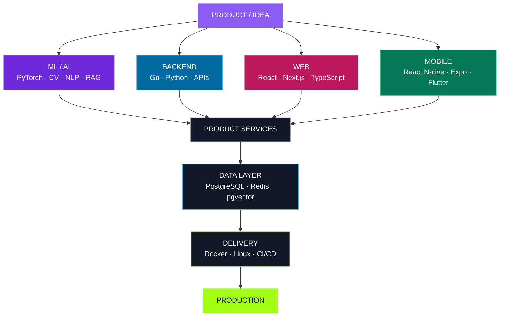

<div align="center">

# DANIIL CHEPKO

### ML & Software Engineer · Tech Lead · Product Builder

<p>
  I build production ML systems, backend services, web products and mobile applications —<br/>
  from the first architecture decision to a working release.
</p>

<p>
  <a href="https://t.me/bits_of_danya">
    
  </a>
  <a href="https://github.com/BitsOfDanya">
    
  </a>
</p>

<p>
  
  
  
  
  
</p>

<sub>Saint Petersburg · Engineering complete products, not isolated components</sub>

</div>

---

## `01 / PROFILE`

<table>
<tr>
<td width="64%" valign="top">

### Hi, I'm Daniil.

I'm a **Machine Learning Engineer, Software Engineer and Tech Lead** working across applied AI and product engineering.

My strongest specialization is **production Machine Learning**: Computer Vision, video understanding, NLP, embeddings, retrieval and multimodal systems. At the same time, I design and build the software around models — APIs, databases, backend services, web interfaces, mobile applications, infrastructure and delivery pipelines.

I am most useful where a product needs one technical picture instead of disconnected teams and technologies:

> **ML × Backend × Web × Mobile × Product Architecture**

I care about measurable product value, maintainable architecture and actually shipping the result.

</td>
<td width="36%" valign="top">

### `SYSTEM.IDENTITY`

```yaml
name: Daniil Chepko
username: BitsOfDanya

roles:
  - ML Engineer
  - Software Engineer
  - Tech Lead

location: Saint Petersburg

working_mode:
  - research
  - architecture
  - engineering
  - delivery
```

</td>
</tr>
</table>

<table>
<tr>
<td align="center" width="25%">

### `3+`

Years in production ML

</td>
<td align="center" width="25%">

### `50+`

Hackathon wins & prizes

</td>
<td align="center" width="25%">

### `5`

Engineering directions

</td>
<td align="center" width="25%">

### `0 → 1`

Idea to production

</td>
</tr>
</table>

---

## `02 / ENGINEERING STACK`

<div align="center">

### Languages


### Frameworks & Platforms


### Data, Infrastructure & Delivery


</div>

<br/>

<table>
<tr>
<td width="25%" valign="top">

### 🟣 `ML / AI`

**Core**

`Python` · `PyTorch` · `OpenCV`

**Applied ML**

`Computer Vision`  
`Video Understanding`  
`Classification`  
`NLP`  
`Transformers`  
`Embeddings`  
`Multimodal ML`

**AI Systems**

`RAG`  
`LLM APIs`  
`LangChain`  
`LangGraph`  
`Semantic Retrieval`  
`Vector Search`

</td>
<td width="25%" valign="top">

### 🔵 `BACKEND`

**Core**

`Go` · `Python` · `SQL`

**Frameworks**

`Gin`  
`chi`  
`FastAPI`  
`Node.js`

**Engineering**

`REST API`  
`WebSocket`  
`OpenAPI / Swagger`  
`Authentication`  
`Background Workers`  
`Service Architecture`  
`Object Storage`

</td>
<td width="25%" valign="top">

### 🩷 `FRONTEND`

**Core**

`TypeScript` · `JavaScript`

**Frameworks**

`React`  
`Next.js`  
`Vite`

**UI & Product**

`Tailwind CSS`  
`shadcn/ui`  
`Responsive UI`  
`Design Systems`  
`Dashboards`  
`Admin Panels`  
`Landing Pages`  
`SaaS Interfaces`

</td>
<td width="25%" valign="top">

### 🟢 `MOBILE`

**React ecosystem**

`React Native`  
`Expo`

**Flutter ecosystem**

`Flutter`  
`Dart`

**Engineering**

`iOS / Android`  
`App Architecture`  
`API Integration`  
`Authentication`  
`Navigation`  
`State Management`  
`Cross-platform UI`

</td>
</tr>
</table>

<details>
<summary><b>🧩 Open the extended engineering map</b></summary>

<br/>

<table>
<tr>
<td width="33%" valign="top">

### `DATA`

- PostgreSQL
- Redis
- SQL
- pgvector
- Vector search
- S3-compatible storage
- MinIO
- Firebase

</td>
<td width="33%" valign="top">

### `INFRASTRUCTURE`

- Docker
- Docker Compose
- Linux
- Nginx
- Networking
- Environment configuration
- Observability basics
- Deployment

</td>
<td width="33%" valign="top">

### `DELIVERY`

- Git / GitHub
- GitHub Actions
- CI/CD
- API documentation
- Testing strategy
- Release preparation
- Netlify
- Production handoff

</td>
</tr>
<tr>
<td width="33%" valign="top">

### `ARCHITECTURE`

- System design
- API design
- Data modeling
- Service decomposition
- Integration design
- Technical strategy
- MVP → production

</td>
<td width="33%" valign="top">

### `PRODUCT`

- Technical discovery
- Scope definition
- Rapid prototyping
- Product analytics
- Cross-functional work
- Engineering leadership
- Delivery ownership

</td>
<td width="33%" valign="top">

### `ADDITIONAL CORE`

- Java
- C++
- C
- Algorithms
- Data structures
- Computer networks
- System administration

</td>
</tr>
</table>

</details>

---

## `03 / HOW THE SYSTEM CONNECTS`



<div align="center">

**Different stacks. One technical system. One product outcome.**

</div>

---

## `04 / SELECTED PRODUCTS`

<table>
<tr>
<td width="50%" valign="top">

### `01 / CADIO.`

#### SportsTech · Web · Mobile

Digital ecosystem for athletes, sports communities, clubs and event organizers. It connects discovery, events, participant experiences and organizer tools across web and mobile products.

`Next.js` · `TypeScript` · `React` · `Flutter` · `PostgreSQL`

</td>
<td width="50%" valign="top">

### `02 / TRUSTDESK`

#### AI · B2B SaaS · Knowledge Work

AI-powered workspace for document intelligence, risk analysis, decision rooms, knowledge retrieval and auditable collaboration inside organizations.

`Next.js` · `Go` · `FastAPI` · `RAG` · `PostgreSQL` · `Redis`

</td>
</tr>
<tr>
<td width="50%" valign="top">

### `03 / POLYK`

#### EdTech · Community · Marketplace

University-focused ecosystem built around teachers, reviews, educational materials, mentoring and student services — with a shared platform for students to find practical help.

`React` · `Vite` · `TypeScript` · `Go` · `PostgreSQL`

</td>
<td width="50%" valign="top">

### `04 / KARETA`

#### Gaming · Social Platform

Gaming community platform combining social content, profiles, chats, tournaments, marketplace mechanics and user-created experiences.

`Mobile` · `Backend` · `Social` · `Marketplace` · `Gaming`

</td>
</tr>
<tr>
<td width="50%" valign="top">

### `05 / SMARTBLOODTEST`

#### MedTech · Image Analysis

Software workflow for laboratory image analysis and blood-group phenotyping with preliminary automated analysis and remote validation by a laboratory specialist.

`Computer Vision` · `Backend` · `Web` · `Mobile` · `MedTech`

</td>
<td width="50%" valign="top">

### `06 / ML & HACKATHON R&D`

#### AI · Engineering · Rapid Prototyping

Applied projects across Computer Vision, NLP, multimodal ML, retrieval, LLM agents and end-to-end product prototypes built under hard time and resource constraints.

`ML` · `AI Systems` · `Backend` · `Architecture` · `Product`

</td>
</tr>
</table>

<details>
<summary><b>⚡ What I own inside a product</b></summary>

<br/>

| Stage | What I do | Typical output |
|---|---|---|
| `01 · DISCOVER` | Turn a vague idea into a technical problem | Requirements, risks, scope, success metrics |
| `02 · DESIGN` | Select architecture and define system boundaries | System design, API contracts, data model |
| `03 · BUILD` | Implement the critical product layers | ML pipeline, backend, web or mobile client |
| `04 · INTEGRATE` | Connect services, data and user flows | End-to-end working product scenario |
| `05 · SHIP` | Prepare the system for real usage | Docker, CI/CD, documentation, deployment |
| `06 · IMPROVE` | Measure quality and remove bottlenecks | Evaluation, analytics, performance iteration |

</details>

---

## `05 / ENGINEERING MODES`

<table>
<tr>
<td align="center" width="20%">

### 🧠 ML

Models  
Evaluation  
Pipelines  
Retrieval

</td>
<td align="center" width="20%">

### ⚙️ Backend

APIs  
Services  
Databases  
Workers

</td>
<td align="center" width="20%">

### 🖥️ Web

SaaS  
Dashboards  
Admin tools  
Interfaces

</td>
<td align="center" width="20%">

### 📱 Mobile

iOS / Android  
Cross-platform  
Integration  
UX flows

</td>
<td align="center" width="20%">

### 🧭 Lead

Architecture  
Strategy  
Delivery  
Ownership

</td>
</tr>
</table>

<div align="center">


</div>

---

## `06 / CURRENT FOCUS`

<table>
<tr>
<td width="50%" valign="top">

### `ENGINEERING`

```yaml
web:
  - TypeScript
  - React
  - Next.js

mobile:
  - React Native
  - Expo
  - Flutter

backend:
  - Go
  - Python
  - PostgreSQL
  - Redis
```

</td>
<td width="50%" valign="top">

### `INTELLIGENCE`

```yaml
machine_learning:
  - Computer Vision
  - Video Understanding
  - NLP
  - Multimodal ML

ai_systems:
  - Embeddings
  - Retrieval
  - RAG
  - LLM Applications
```

</td>
</tr>
</table>

---

## `07 / GITHUB SIGNAL`

<div align="center">

<picture>
  <source media="(prefers-color-scheme: dark)" srcset="https://github-profile-summary-cards.vercel.app/api/cards/profile-details?username=BitsOfDanya&theme=github_dark" />
  <source media="(prefers-color-scheme: light)" srcset="https://github-profile-summary-cards.vercel.app/api/cards/profile-details?username=BitsOfDanya&theme=github" />
  
</picture>

<br/>


</div>

<sub>
GitHub language cards reflect public repository bytes, not professional proficiency. The stack above is the intentional engineering profile.
</sub>

---

<div align="center">

## `LET'S BUILD SOMETHING USEFUL`

### ML · Backend · Frontend · Mobile · Architecture

<p>
  <a href="https://t.me/bits_of_danya">
    
  </a>
</p>

```text
IDEA  →  ARCHITECTURE  →  ENGINEERING  →  PRODUCTION
```

<sub>Daniil Chepko · BitsOfDanya</sub>

</div>
