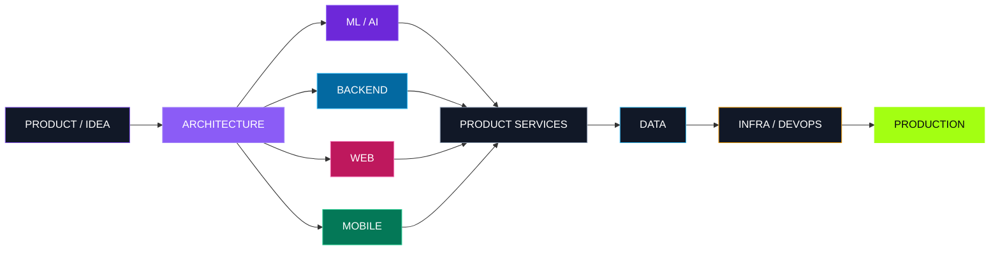

<!--
  BitsOfDanya / GitHub Profile README
  Layout intentionally avoids:
  - fenced code blocks inside HTML tables
  - 5–6 column tables
  - fragile external GitHub statistics cards

  Dynamic/open-source visual dependencies:
  - readme-typing-svg
  - shields.io
  - skillicons.dev
  - Platane/snk (generated by GitHub Actions into the output branch)
-->

# DANIIL CHEPKO

### ML & Software Engineer · Tech Lead

 

  

  

Saint Petersburg · ML systems, software products and platform engineering

---

<h2 align="center">01 / ABOUT</h2>

<table>
<tr>
<td width="58%" valign="top">

### Who I am

I'm **Daniil Chepko** — an **ML Engineer, Software Engineer and Tech Lead**.

My strongest specialization is applied and production **Machine Learning**: Computer Vision, video understanding, NLP, embeddings, retrieval and multimodal systems.

I also work across the surrounding product stack: **backend services, APIs, databases, frontend applications, mobile clients, infrastructure and technical architecture**.

I prefer problems where several engineering areas have to become one coherent product rather than isolated components.

</td>
<td width="42%" valign="top">

### Engineering profile

**ML / AI**  
Production ML · CV · NLP · Multimodal · RAG

**Backend**  
Go · Python · APIs · Data · Services

**Frontend**  
TypeScript · React · Next.js · Product UI

**Mobile**  
React Native · Expo · Flutter

**Infrastructure**  
Docker · Linux · CI/CD

**Architecture**  
System design · Technical strategy · Delivery

</td>
</tr>
</table>

<table>
<tr>
<td align="center" width="25%"><b>3+</b> Years in production ML</td>
<td align="center" width="25%"><b>50+</b> Hackathon wins & prizes</td>
<td align="center" width="25%"><b>6</b> Engineering directions</td>
<td align="center" width="25%"><b>0 → 1</b> Idea to production</td>
</tr>
</table>

 

`IDEA`  →  `ARCHITECTURE`  →  `ENGINEERING`  →  `PRODUCTION`

---

<h2 align="center">02 / STACK</h2>

### Languages

  

### Web · Mobile · Backend

  

### Data · Infrastructure · Delivery

 

<table>
<tr>
<td width="50%" valign="top">

### `ML / AI`

**Core**  
`Python` · `PyTorch` · `OpenCV`

**Applied ML**  
`Computer Vision` · `Video Understanding` · `Classification` · `NLP` · `Transformers` · `Embeddings` · `Multimodal ML`

**AI Systems**  
`RAG` · `LLM APIs` · `LangChain` · `LangGraph` · `Semantic Retrieval` · `Vector Search`

**Engineering**  
`Training Pipelines` · `Evaluation` · `Inference` · `Model Integration`

</td>
<td width="50%" valign="top">

### `BACKEND / DATA`

**Languages**  
`Go` · `Python` · `Java` · `C++`

**Backend**  
`Gin` · `chi` · `FastAPI` · `Node.js` · `REST` · `WebSocket` · `OpenAPI`

**Data**  
`PostgreSQL` · `Redis` · `SQL` · `pgvector` · `Vector Search`

**Services**  
`Authentication` · `Workers` · `Object Storage` · `Integrations`

</td>
</tr>
<tr>
<td width="50%" valign="top">

### `FRONTEND`

**Core**  
`TypeScript` · `JavaScript` · `React`

**Frameworks**  
`Next.js` · `Vite`

**UI / Product**  
`Tailwind CSS` · `shadcn/ui` · `Responsive UI` · `Design Systems`

**Interfaces**  
`SaaS` · `Dashboards` · `Admin Panels` · `Landing Pages`

</td>
<td width="50%" valign="top">

### `MOBILE / DEVOPS`

**Mobile**  
`React Native` · `Expo` · `Flutter` · `Dart` · `iOS / Android`

**Mobile Engineering**  
`Navigation` · `State Management` · `Authentication` · `API Integration`

**DevOps / Infra**  
`Docker` · `Docker Compose` · `Linux` · `Nginx` · `GitHub Actions` · `CI/CD` · `Deployment`

</td>
</tr>
</table>

<b>Extended engineering toolbox</b>

 

<table>
<tr>
<td width="33%" valign="top">

### SYSTEMS

`C` · `C++` · `Java`

Algorithms  
Data Structures  
Computer Networks  
System Administration  
Performance Thinking

</td>
<td width="33%" valign="top">

### ARCHITECTURE

System Design  
API Design  
Data Modeling  
Service Decomposition  
Integration Design  
MVP → Production

</td>
<td width="33%" valign="top">

### DELIVERY

Git / GitHub  
CI/CD  
API Documentation  
Testing Strategy  
Release Preparation  
Production Handoff

</td>
</tr>
</table>

---

<h2 align="center">03 / ENGINEERING MAP</h2>

ML, software and infrastructure designed as one product system.

---

<h2 align="center">04 / SELECTED PROJECTS</h2>

<table>
<tr>
<td width="50%" valign="top">

### `01 / CADIO`

**SportsTech Platform**

Digital ecosystem for athletes, sports communities, clubs and event organizers.

The product connects community discovery, events, participant experiences and organizer tools across web and mobile.

`SportsTech` · `Web` · `Mobile` · `Platform`

</td>
<td width="50%" valign="top">

### `02 / TRUSTDESK`

**AI Workspace**

AI-powered workspace for document intelligence, business knowledge and decision-making.

Combines document analysis, knowledge retrieval, AI-assisted workflows and collaborative decision processes.

`AI` · `B2B SaaS` · `Documents` · `RAG`

</td>
</tr>
<tr>
<td width="50%" valign="top">

### `03 / POLYK`

**Student Ecosystem**

University-focused platform around teachers, reviews, educational materials, mentoring and student services.

Designed to turn fragmented university knowledge into a practical digital ecosystem.

`EdTech` · `Community` · `Marketplace` · `Platform`

</td>
<td width="50%" valign="top">

### `04 / KARETA`

**Gaming Community Platform**

Gaming ecosystem combining social content, profiles, communication, tournaments, marketplace mechanics and user-created experiences.

`Gaming` · `Mobile` · `Community` · `Marketplace`

</td>
</tr>
<tr>
<td width="50%" valign="top">

### `05 / SMARTBLOODTEST`

**MedTech / Image Analysis**

Software workflow for laboratory image analysis and blood-group phenotyping with preliminary automated analysis and remote specialist validation.

`MedTech` · `Image Analysis` · `Automation` · `Web / Mobile`

</td>
<td width="50%" valign="top">

### `06 / ML & HACKATHON R&D`

**AI / Engineering / Rapid Prototyping**

Applied projects across Computer Vision, NLP, multimodal ML, retrieval, LLM agents, backend systems and end-to-end prototypes.

`ML` · `AI Systems` · `Backend` · `R&D` · `Product`

</td>
</tr>
</table>

---

<h2 align="center">05 / WHAT I WORK ACROSS</h2>

<table>
<tr>
<td width="33%" valign="top">

### INTELLIGENCE

Models  
Computer Vision  
NLP  
Embeddings  
Multimodal  
Retrieval  
RAG  
Inference

</td>
<td width="33%" valign="top">

### SOFTWARE

Backend Services  
Web Products  
Mobile Apps  
APIs  
Databases  
Workers  
Integrations  
Product Interfaces

</td>
<td width="33%" valign="top">

### SYSTEMS

Architecture  
DevOps  
Infrastructure  
CI/CD  
Deployment  
Technical Strategy  
Delivery  
Tech Leadership

</td>
</tr>
</table>

 

---

<h2 align="center">06 / ACTIVITY</h2>

<!--
The snake is generated by .github/workflows/snake.yml.
Run the workflow once from the Actions tab after committing the files.
-->

<picture>
  <source
    media="(prefers-color-scheme: dark)"
    srcset="https://raw.githubusercontent.com/BitsOfDanya/BitsOfDanya/output/github-contribution-grid-snake-dark.svg"
  />
  <source
    media="(prefers-color-scheme: light)"
    srcset="https://raw.githubusercontent.com/BitsOfDanya/BitsOfDanya/output/github-contribution-grid-snake.svg"
  />
  
</picture>

---

## LET'S BUILD SOMETHING USEFUL

**ML · Backend · Frontend · Mobile · DevOps · Architecture**

 

  

`BUILD → SHIP → IMPROVE`

  

Daniil Chepko · BitsOfDanya

